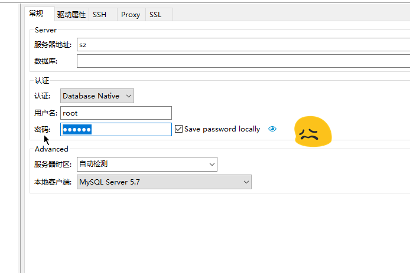
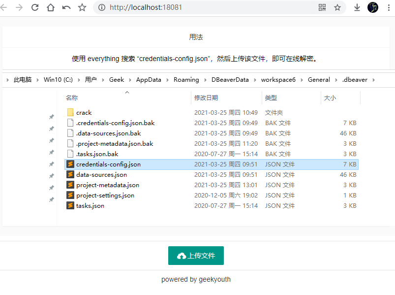
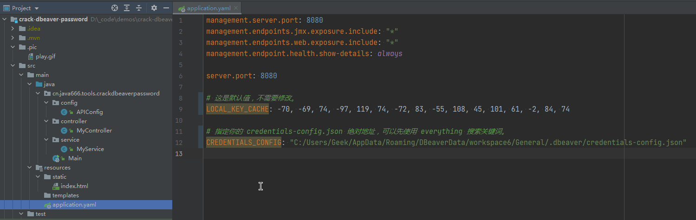

# 在线体验：
<https://crack-dbeaver-password-geekyouth.cloud.okteto.net/>
<https://crack-dbeaver-password.onrender.com/>  
<https://crack-dbeaver-password.herokuapp.com/>

> dbeaver 密码破解工具，我的密码必须由我做主。调试阶段可以配合 postman 食用。

## 我为什么要破解 Dbeaver 的密码？


dbeaver 客户端非常强大，可以连接一百多种数据库。但是最难受的地方是不允许方便的查看已保存的密码，如果一定要查看密码，必须先设定一个主密码，而且每次打开客户端都需要验证主密码，所以我拒绝。于是找了一下网络上有同样困惑的人，然后整理重构为此项目。希望可以更方便的拿到自己的明文密码。

## 使用截图：

### 🎀1.0.2 以上版本已经支持在首页 <http://localhost:8080> 直接上传 credentials-config.json 文件了，方便快捷。如果还想了解更多食用方式请往下看。



### 1、先配置你的 credentials-config.json 文件地址，注意用户名，也可以直接跳到第 2 步：


### 2、启动项目后，使用 postman 发请求，这里可以上传你的 credentials-config.json 文件，无需修改额外配置：


### 3、控制台也可以调试接口，推荐有开发能力的同学使用：


## Docker 镜像速食：
```
docker run -d -p 8080:80 --name crack-dbeaver-password-80 geekyouth/crack-dbeaver-password:latest
```

---
## 参考：

提问： <https://stackoverflow.com/questions/39928401/recover-db-password-stored-in-my-dbeaver-connection/57630312#57630312>

解决方案：

python：  
<https://gist.github.com/felipou/50b60309f99b70b1e28f6d22da5d8e61>

shell:
<https://github.com/Tatsh/dbeaver-creds/blob/master/dbeaver-creds>

java:
<https://stackoverflow.com/a/57630312/9633499>

<https://github.com/dbeaver/dbeaver/blob/d69a75e63bf0a00e37f6b4ab9c9aa4fcaa0ded23/plugins/org.jkiss.dbeaver.model/src/org/jkiss/dbeaver/model/impl/app/DefaultSecureStorage.java#L32>

<https://github.com/dbeaver/dbeaver/blob/2028bc56cef2df1ac1a02c4d47bc86bbfc3dd4dc/plugins/org.jkiss.dbeaver.model/src/org/jkiss/dbeaver/model/impl/app/DefaultSecureStorage.java#L32>

---
IntelliJ IDEA中报错：Error: java: 无效的目标发行版本: 11
<https://juejin.cn/post/6844903791498674183>

## 更新日志：
### 1.1.5:
Springboot + docker 生态最佳实践。
- 优化 dockerfile
- 提供 docker-compose 自动编译配置文件
### 1.0.1：
- 解决弹层无法展示 json 的问题 

### 1.0.2:
- 优化首页展示。1.0.2 版本已经支持在首页直接上传 credentials-config.json 文件了，方便快捷。

### 1.1.0:
- 使用 github action 持续集成，编译 docker image。

### 1.1.1:
- 降级 JDK 到 1.8，太多场景无法兼容 jdk11。
